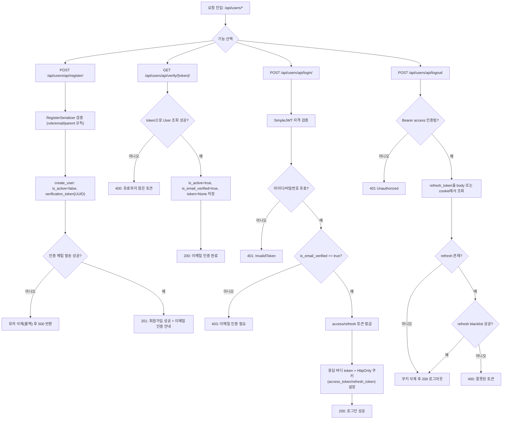
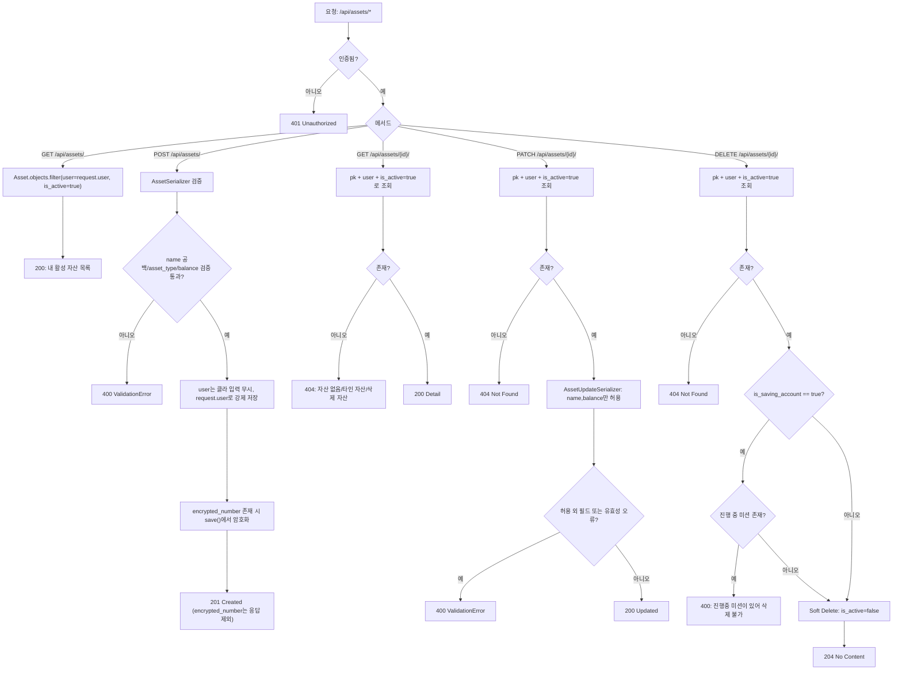
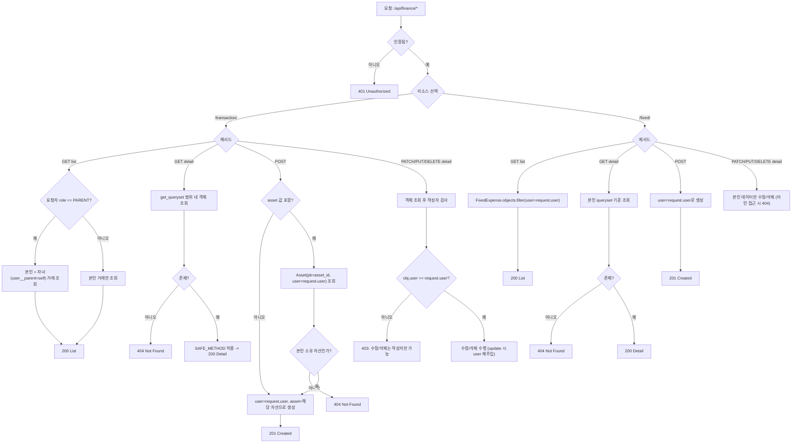
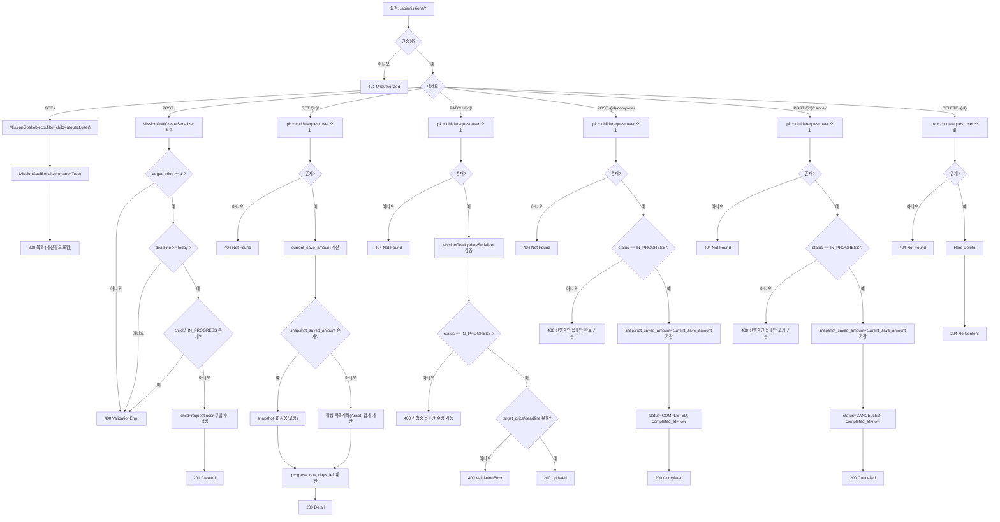
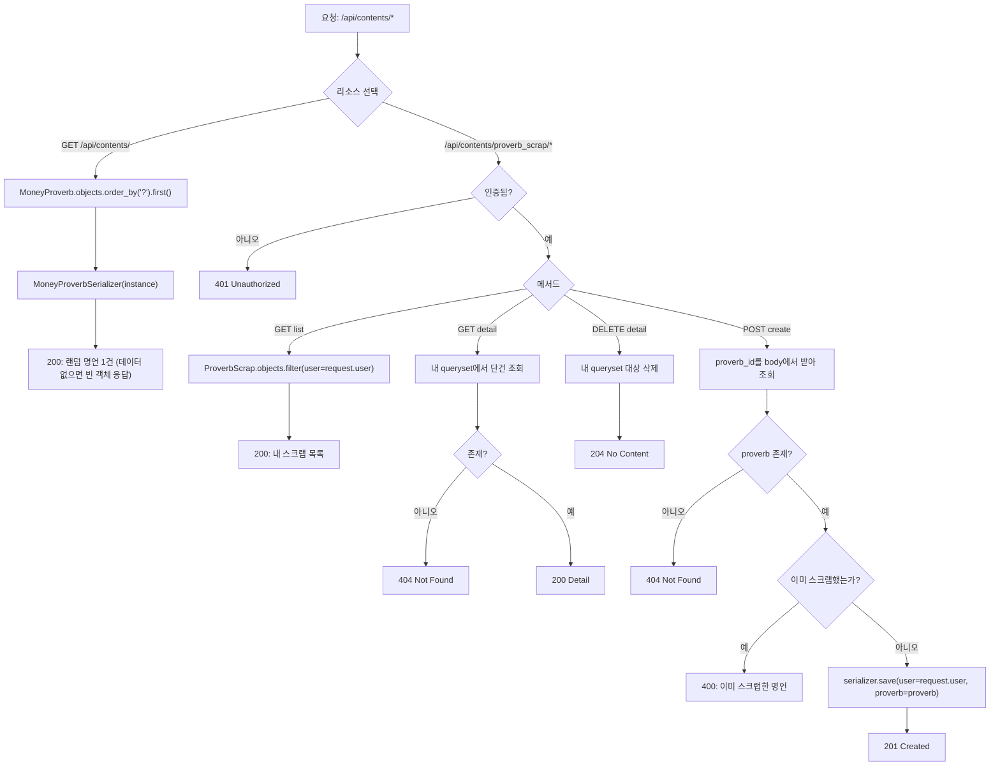

# 사자사자 가계부 플로우차트 모음

작성일: 2026-02-27
기준: 현재 코드베이스(as-is) `users`, `assets`, `finance`, `missions`, `contents`

---

## 1) Users 인증 플로우 (회원가입/이메일인증/로그인/로그아웃)

---

## 2) Assets 플로우

---

## 3) Finance 플로우 (Transaction + FixedExpense)

---

## 4) Missions 플로우

---

## 5) Contents 플로우 (랜덤 명언 + 스크랩)

